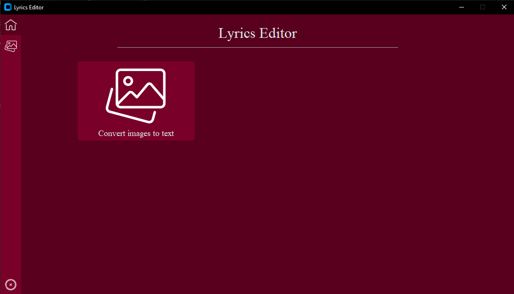
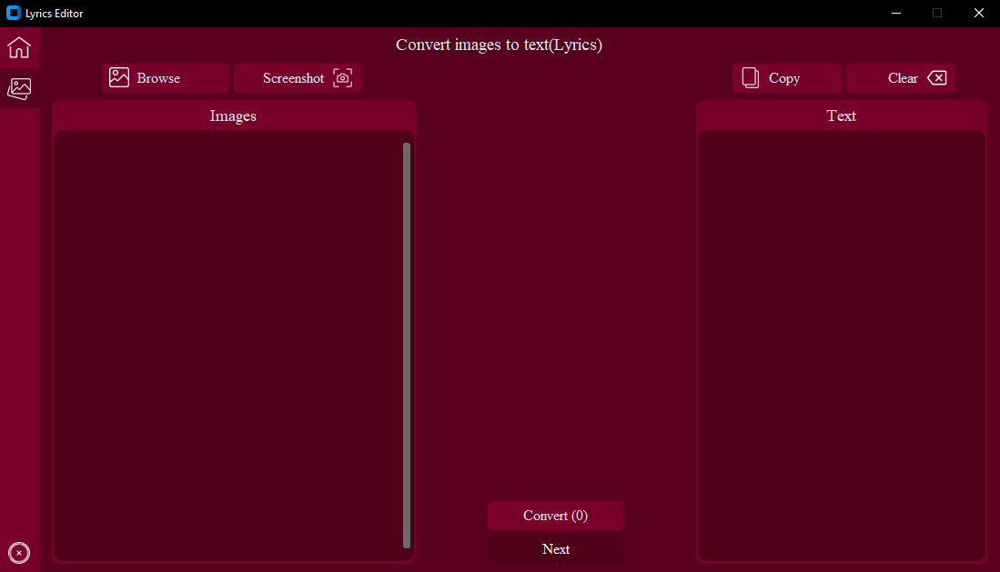

# Image to text converter
Python-screenshot-to-text-converter will be rebuilt to Image to text converter with a better User Interface. You will require an internet connection when running the program for the first time.

## Installation
- Open the command prompt and run the following command:
 ``` 
  pip3 install -r requirements.txt 
  ```

## Overview



**Note:** I will not be continuing with these project but feel free to contribute.


